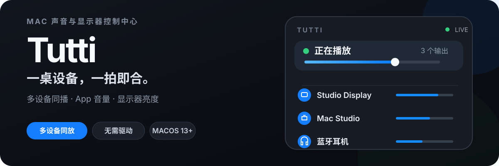
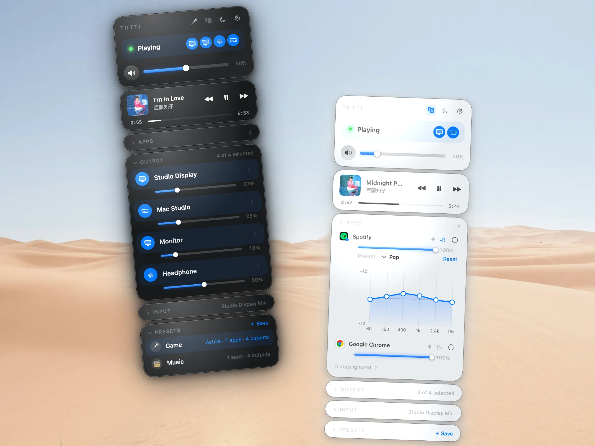
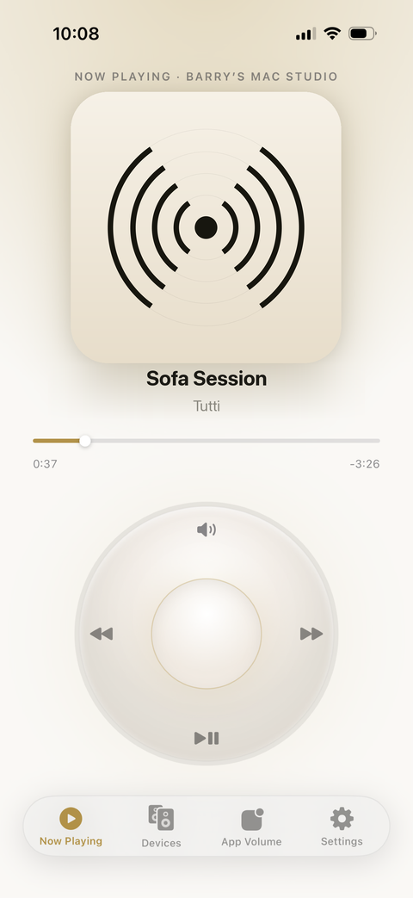
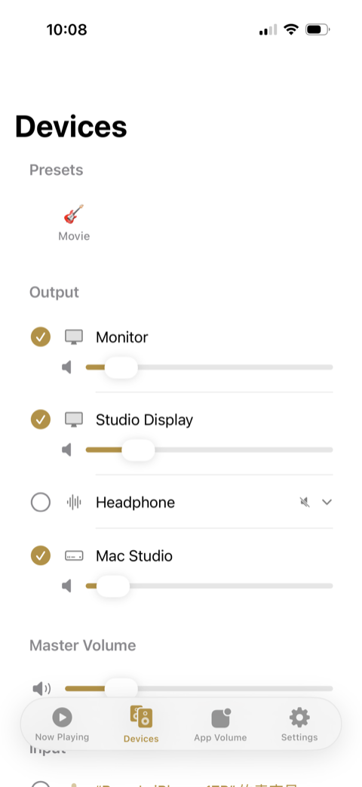
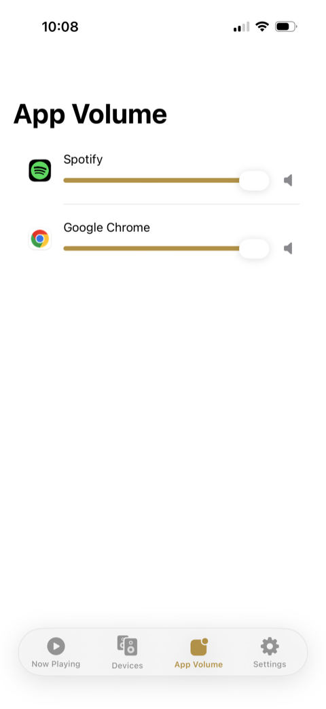
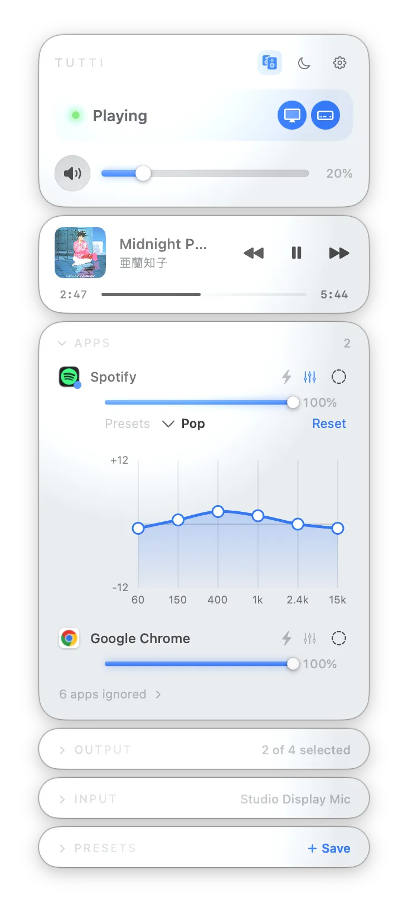
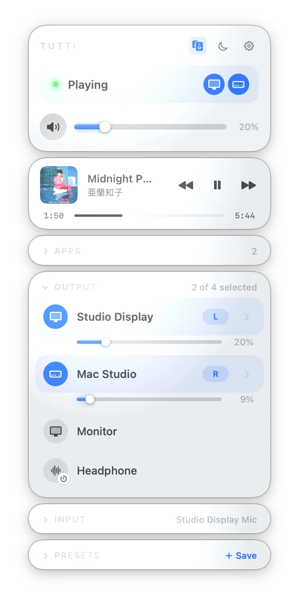
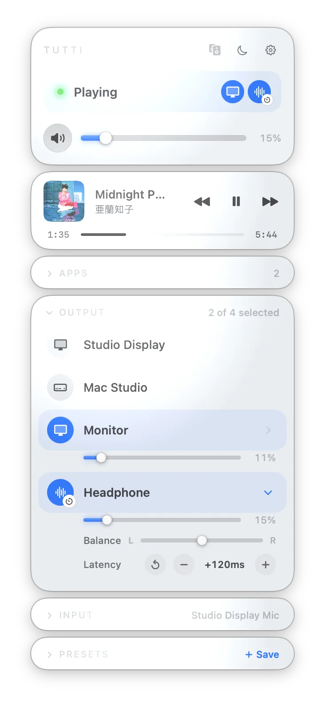

<p align="right"><a href="README.md">English</a> · 中文</p>

<p align="center">
  
</p>

<p align="center">
  
  
  
  
</p>

<p align="center">
  
</p>

<p align="center"><sub><strong>无虚拟驱动 · 无系统扩展 · 无遥测 · 无账号。</strong>经 Apple 公证。退出 Tutti,你的音频设置原样如初。</sub></p>

## 一个面板，管好整套声音

macOS 只给你一个音量滑块、一份设备列表和一个小喇叭图标,仅此而已。你没法同时向两个音箱放声,没法给每个 App 单独设音量,也没法只给某个 App 调 EQ 而不动其他。Tutti 就是补上这块空白的控制中心:一个面板管好每个输出、每个 App、每一档音量 —— 全部基于 Apple 自家音频框架,不往系统里装任何东西。

- **一处声音，多个输出** —— 同时播放到多台音箱，并让它们保持对齐。
- **每个 App，各有设置** —— 单独调整音量、EQ 和输出，不影响其他声音。
- **人在沙发，也能控制 Mac** —— 用 iPhone 切预设、选音箱和控制播放。

## 安装

下载[最新版 DMG](https://github.com/BarryBarrywu/tutti/releases/latest/download/Tutti.dmg)，或使用 Homebrew 安装：

```bash
brew install --cask barrybarrywu/tap/tutti
```

安装后，Tutti 会自动检查更新。

## Tutti Remote —— 已上架 App Store

**用 iPhone 遥控 Mac 的声音。**窝在沙发上就能切换预设、挑选输出音箱、调节每台设备和每个 App 的音量,还能用 iPod 式转盘控制播放。通过局域网配对,控制权始终在 Mac 这一侧。iPhone App 免费下载;遥控 Mac 需要 Mac 端的 Tutti Pro。

<p align="center">
  <a href="https://apps.apple.com/app/tutti-remote/id6788375184"><strong>在 App Store 下载 Tutti Remote →</strong></a>
</p>

<p align="center">
  
  &nbsp;&nbsp;
  
  &nbsp;&nbsp;
  
</p>

## 功能

### 多设备输出
- **一次放给所有音箱** —— 勾选多个输出,Tutti 即时组建 CoreAudio 聚合设备,并保持时钟同步。
- **也可以只放一个** —— 只选一台时,Tutti 直接切换系统默认输出,不建聚合。
- **主音量 + 每设备音量与静音** —— 一个总滑块管全部,每个输出还有独立滑块和静音。
- **三态状态** —— 全部在放、部分静音、全部静音,配同色状态点。
- **热插拔不断音** —— 播放中增减音箱,声音不中断。
- **设备守护** —— 给输出设备排好优先顺序,并锁定默认输出、输入和音量;macOS 或别的 App 在背后乱切时,Tutti 替你切回来。
- **记住你的组合** —— 音箱编组、各自音量和静音状态在退出 Tutti 或自动更新后原样恢复。

### 显示器控制 &nbsp;`macOS 15+`
- **整组 + 单台亮度** —— 选择要控制的显示器,统一调整整个亮度组,或只调整其中一台。
- **支持时使用硬件调光** —— 内置屏和兼容的 Apple 显示器使用系统亮度,DDC/CI 显示器使用硬件控制,其余显示器可使用明确标识的软件调光。
- **跟随内置屏** —— 外接显示器可以保留原有亮度差,同时跟随手动调整和 macOS 自动亮度。
- **亮度键与滚轮** —— 键盘亮度键会调整所选显示器并显示 Tutti 进度条;把指针停在整组或单台显示器上滚动即可调整对应目标。
- **显示器预设 + iPhone 控制** &nbsp;`Pro` —— 把显示器选择和亮度保存进预设,或通过 Tutti Remote 1.1.0 调整。

Tutti 的显示器亮度引擎参考了开源项目 [Crisp](https://github.com/didriksg/Crisp),感谢 didriksg 与项目贡献者分享相关工作。

### 单个 App 音频控制 &nbsp;`macOS 14.4+`
- **单个 App 音量 + Turbo** &nbsp;`免费` —— 给每个 App 单独的音量;Turbo 可加 2× 增益。无驱动,走原生音频 tap。
- **单个 App 均衡器** &nbsp;`免费` —— 为任意 App 拖动 6 段 EQ 曲线,或套用内置预设。
- **单个 App 输出** &nbsp;`Pro` —— 把不同 App 送到不同音箱:通话留在笔记本,音乐充满房间。
- **看清声音去哪** —— 输出设备上会显示路由到它的 App 小徽标。
- **忽略不想管的 App** —— 右键任意 App 把它收进列表底部。

<p align="center">
  
</p>

### Pro 强力工具
- **预设** &nbsp;`Pro` —— 保存设备 + 音量 + 单个 App 设置组合,一键切换;每个预设配一个 emoji。
- **全局快捷键** &nbsp;`Pro` —— 在任意 App 里用热键打开面板、静音、切预设,或微调某个 App 的音量。
- **跨设备立体声配对** &nbsp;`Pro` —— 左声道给一台音箱、右声道给另一台 —— 两台音箱,一对立体声。
- **每台音箱左右平衡** &nbsp;`Pro` —— 音箱摆得偏一侧时,把它的声音往一边偏一点。
- **单设备延迟微调** &nbsp;`Pro` —— 蓝牙音箱慢半拍时,凭耳朵加一点延迟对齐。
- **桌面小组件** &nbsp;`Pro` —— 不开 App,在桌面看状态、设备,调音量、切预设。

<p align="center">
  
  &nbsp;&nbsp;
  
</p>

### Now Playing 与媒体
- **Now Playing 卡片** —— Spotify、Apple Music 的歌曲、封面、播放/暂停/切歌,都在面板里。
- **通话与视频自动让路** &nbsp;`免费` —— 有通话或视频出声时淡出并暂停音乐,结束后按原音量淡入。
- **麦克风输入卡片** —— 在面板里挑选输入设备、调节音量或静音。

### 蓝牙与同步
- **自行重连** —— 编组里的蓝牙音箱短暂掉线后,重连即自动归队,不中断播放。
- **耳机收起自动归位** —— AirPods 收起后,Tutti 自动切回你之前的音箱编组和预设。
- **耳机电量** —— 设备上报时,在设备名旁显示;AirPods 有专属图标。
- **通话后保持高音质** —— 通话时改用内置麦克风,耳机不会卡在闷闷的通话音质里。
- **始终同步** —— 时钟漂移补偿让有线和蓝牙音箱对齐,不会越放越偏。

### 菜单栏 · 快捷键 · 那些小细节
- **菜单栏快捷菜单** —— 不打开面板就能切设备、换预设、全部静音。
- **音量接管** —— 键盘音量键和滚轮全局驱动聚合输出。
- **Shortcuts、Siri 与 Spotlight** —— 在自动化里切预设、静音或设音量。
- **指哪滚哪** —— 悬停某台设备、某个 App 或麦克风,滚轮只调它。
- **自选菜单栏图标** —— 经典声波,或十种乐器之一;图标随音量升高而填充。
- **睡眠定时 · 渐入渐出 · 浅色/深色/跟随系统 · 登录启动 · 自动更新** —— 该有的省心功能都有。

### 更多控制方式
- **Raycast 扩展** —— 在 Raycast 里静音、设音量、切预设。

  <a href="https://www.raycast.com/Barrybarrywu/tutti" title="安装 Tutti Raycast 扩展"></a>

## 免费 vs Pro

上面所有不带标签的功能都是**永久免费**。每次全新安装首启还送 **7 天 Pro 试用** —— 无需 key。试用结束后,所有免费功能继续无限使用。

**Pro 解锁:**

| | |
|---|---|
| **预设** | 一键切换设备 + 音量 + 单个 App 设置组合 |
| **全局快捷键** | 在任意 App 内控制 Tutti |
| **立体声配对与左右平衡** | 把声道拆到不同音箱 |
| **单设备延迟微调** | 凭耳朵对齐慢半拍的蓝牙音箱 |
| **单个 App 输出路由** | 把不同 App 送到不同音箱 |
| **桌面小组件** | 在桌面查看状态与控制 |
| **Raycast 控制** | 在 Raycast 里静音、设音量或套用预设 |
| **iPhone 遥控** | 用 iPhone 遥控 Mac 的声音(iPhone App 免费,Mac 端需 Pro) |
| **显示器预设与 iPhone 亮度控制** | 保存显示器组合与亮度,并通过 iPhone 调整 |

- **一次性 $12.99,无订阅。**未来所有 Pro 新功能免费包含。
- **每个授权可激活 2 台 Mac。**在 设置 › 许可 里激活与停用。
- **14 天无理由退款** —— 发邮件到 support@barrybarrywu.com 即可。

<p align="center">
  <a href="https://checkout.dodopayments.com/buy/pdt_0NfolyiommnaLUYQ5aPqn"><strong>解锁 Tutti Pro —— $12.99</strong></a>
</p>

## 与同类对比

优秀的 Mac 音频工具各自解决了其中一块。Tutti 站在这里。

| | Tutti | Background Music | FineTune | SoundSource | Audio Hijack |
|---|:---:|:---:|:---:|:---:|:---:|
| 同一声音同放多个输出 | ✓ | — | ✓ | ✓ | ✓⁴ |
| 单个 App 音量 | ✓¹ | ✓ | ✓ | ✓ | ✓⁴ |
| 单个 App EQ | ✓¹ | — | ✓ | ✓ | ✓⁴ |
| 第三方 Audio Unit 音效 | — | — | — | ✓ | ✓ |
| 单个 App 输出路由 | ✓¹ | — | ✓ | ✓ | ✓ |
| 一键恢复设备 + App 预设 | ✓ | — | — | ✓ | — |
| 输出设备优先顺序 | ✓ | — | ✓ | ✓ | — |
| AirPlay 加入多输出组 | — | — | — | ✓ | — |
| **跨设备立体声配对** | ✓ | — | — | — | — |
| **单设备蓝牙延迟微调** | ✓ | — | — | — | — |
| **Now Playing 控制**(播放/暂停/切歌) | ✓ | — | — | — | — |
| **iPhone 遥控** | ✓ | — | — | — | — |
| 无需安装额外音频组件 | ✓² | — | ✓ | — | ✓³ |
| 免费且不限时使用 | ✓ | ✓ | ✓ | — | — |

¹ 单个 App 功能走原生 macOS 音频 tap,需 macOS 14.4 及以上。

² Tutti 多输出使用 CoreAudio 聚合设备,单个 App 控制使用原生 tap,无需额外安装组件。Background Music 会安装虚拟音频设备;SoundSource 需要安装 ARK 插件。

³ 在 macOS 14.4 及以上版本中,Audio Hijack 使用原生系统音频访问,无需安装额外音频组件。

⁴ Audio Hijack 通过可配置的 session 提供这些能力,并非菜单栏调音台式操作。

竞品能力根据当前的 [Background Music](https://github.com/kyleneideck/BackgroundMusic)、[FineTune](https://github.com/ronitsingh10/FineTune)、[SoundSource 6](https://www.rogueamoeba.com/soundsource/whatsnew.php) 和 [Audio Hijack](https://rogueamoeba.com/support/manuals/audiohijack/) 官方文档核对。

## 使用场景

- **一起听** —— 客厅音箱和蓝牙耳机同时出声:你外放,朋友戴耳机。
- **直播与录制** —— 用耳机监听的同时,把声音播给观众或采集卡。
- **多房间播放** —— 一台 Mac 同时驱动客厅的有线音箱和卧室的另一对。
- **沙发遥控** —— 不用起身,在 iPhone 上切预设、挑音箱。
- **教学** —— 老师在耳机里听提示,教室音箱同时放给学生。

## AirPlay 与已知限制

- **AirPlay 无法进多输出组** —— macOS 不允许 AirPlay 接收端(HomePod、Apple TV、AirPlay 音箱)加入多输出组,且只有第一方 App 能发起 AirPlay 路由。macOS 已路由到 AirPlay 设备后,Tutti 可单独使用它。见 [Roadmap](#roadmap)。
- **单个 App 功能需 macOS 14.4+** —— 单个 App 音量、Turbo、EQ 和路由依赖 14.4 新增的 Core Audio process tap。在 macOS 13–14.3 上,其余功能照常。
- **蓝牙电量取决于设备** —— 仅当耳机向 macOS 上报时才显示。

## Roadmap

- **Tutti 内直接路由 AirPlay** —— 不必先去控制中心,直接在面板里挑选与切换 AirPlay 接收端。目前 macOS 把 AirPlay 发现限制在第一方;一旦开放,Tutti 立刻跟上。

## 系统要求

- macOS 13.0 或更高
- 仅键盘音量键与亮度键接管需要辅助功能权限(滚轮方式无需)

## 多语言

简体中文 · 繁体中文 · 英语 · 日语 · 韩语 · 法语 · 德语 · 意大利语 · 西班牙语。

## 关注我们

更新、技巧和幕后:

- **小红书** — [tutti 的主页](https://www.xiaohongshu.com/user/profile/64c9b594000000000e0263f1)
- **哔哩哔哩** — [tutti 的空间](https://space.bilibili.com/217963572)

## 源代码

自 2026 年 7 月起,Tutti 不再公开源代码。本仓库用于下载、发布、驱动自动更新的 appcast,以及问题反馈。二进制文件按 [EULA](https://tutti.barrybarrywu.com/terms) 分发。
