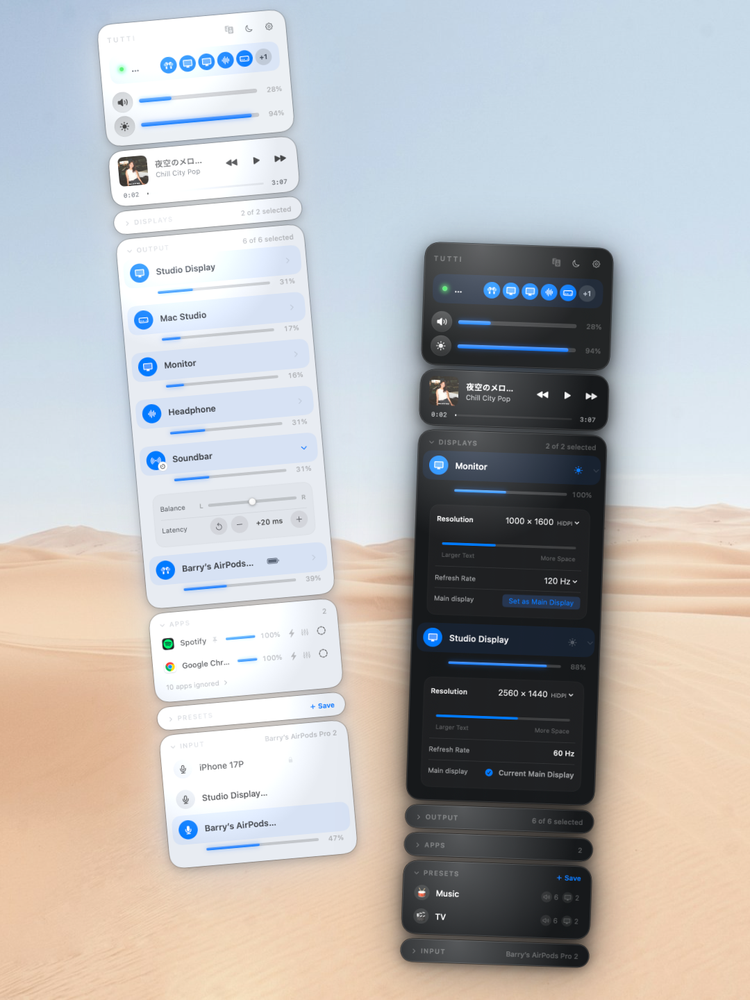

<p align="right"><a href="README.md">English</a> · 中文</p>

<p align="center"></p>
<h1 align="center">Tutti</h1>
<p align="center"><strong>Mac 声音与显示器控制中心。</strong><br>一桌设备，一拍即合。</p>

<p align="center">
  <a href="https://github.com/BarryBarrywu/tutti/releases/latest/download/Tutti.dmg"><strong>下载 Mac 版</strong></a> ·
  <a href="https://tutti.barrybarrywu.com/zh/">官网</a> ·
  <a href="https://tutti.barrybarrywu.com/zh/docs/">使用文档</a>
</p>
<p align="center">
  
  
  
  
</p>
<p align="center"><sub>无需虚拟音频驱动或系统扩展</sub></p>

<p align="center">
  
</p>

## 为什么选择 Tutti？

### 让每台音箱各司其职

多个输出一起播放，还能分别调整。可以把左声道交给一台音箱、右声道交给另一台，调整每台设备的左右平衡，或给较快的输出增加延迟，以匹配较慢的设备。延迟微调不能让蓝牙音频提前到达。

### 声音和屏幕，一起切换场景

用一个预设保存音频输出、音量、App 设置、显示器选择和亮度。看电影时使用音箱并调暗屏幕，工作时再恢复另一套输出与亮度，不必逐项重新设置。分辨率、刷新率和主显示器变更仍仅供本机手动控制，不保存进预设。

### 坐在沙发上，也能控制整套设备

通过局域网，用 iPhone 上的 [Tutti Remote](https://apps.apple.com/app/tutti-remote/id6788375184) 选择输出、调整设备和 App 音量、控制音乐播放或改变显示器亮度。

## 日常控制，也在同一个面板

- **应用：** 独立音量、六段均衡器、Turbo 增益与单个 App 输出路由。
- **显示器：** 单台或整组亮度、跟随内置屏、分辨率、刷新率、现有 HiDPI 模式和主显示器选择；符合条件的屏幕还可使用亮度增益。
- **桌面上的其他控制：** 麦克风、Apple Music 和 Spotify 播放控制，以及维持偏好音频设备和音量的设备守护。

更多功能见[官网功能介绍与交互演示](https://tutti.barrybarrywu.com/zh/)。

## Tutti 的日常用法

### 下班后，把桌面切换成小影院

工作时用耳机、保持适合阅读的屏幕亮度。晚上切换到提前保存的「电影」预设，换成音箱、恢复常用音量，同时调暗屏幕。坐到沙发上，再用 iPhone 调整声音和亮度。

### 自己用耳机听，学生跟着音箱练

教学或排练时，让同一首伴奏同时从耳机和音箱播放：自己戴着耳机跟随音乐，学生听音箱练习。分别调整耳机与外放音量；如果两边存在时间差，可以给较快的输出增加延迟，再把常用组合保存成预设。

### 哪个 App 太响，就单独调低它

工作时让音乐轻轻放着，浏览器里的视频却突然很响。直接在 Tutti 里调低浏览器音量，音乐和 Mac 的总音量都不用动，让每个 App 保持适合自己的音量。

### 两台音箱，分别负责左右声道

把桌面左侧的音箱设为左声道，右侧设为右声道，再分别调整音量，让两边听起来更均衡。如果其中一台播放较慢，可以给较快的一台增加延迟，手动校准后把组合保存成预设。

### 白天看得清，夜晚不刺眼

户外或窗边光线很强，屏幕开到最高亮度仍然看不清时，可以在符合条件的显示器上开启亮度增益。睡前关灯后，屏幕即使调到最低还是太亮，Extra Dim 能让受支持的屏幕继续变暗。

两种调整都可能影响色彩准确性，进行准确校色时应关闭。

## 安装

[下载最新版 DMG](https://github.com/BarryBarrywu/tutti/releases/latest/download/Tutti.dmg)，将 Tutti 拖入「应用程序」后打开。也可以使用 Homebrew：

```bash
brew install --cask barrybarrywu/tap/tutti
```

点击菜单栏图标，选择要使用的输出；勾选多个设备即可一起播放，再统一或分别调整音量。Tutti 会自动检查更新，[版本说明](https://github.com/BarryBarrywu/tutti/releases)记录每次更新的变化。

## 免费与 Pro

**免费，不限使用时间：** 多设备同播、设备音量、单个 App 音量、Turbo 与均衡器，以及受支持 macOS 版本上的本机显示器亮度与显示模式控制。

**Pro 增加：** 预设、单个 App 输出路由、立体声配对、逐设备左右平衡与延迟微调、全局快捷键、桌面小组件、Raycast 控制、iPhone 遥控，以及符合条件的显示器亮度增益。

Tutti Remote 的 iPhone App 免费下载，遥控需要 Mac 端 Tutti Pro。

**一次性 $12.99，无订阅。** 提供 7 天 Pro 试用，每个授权同时激活 1 台 Mac，并提供 14 天退款。试用结束后，免费功能继续可用。[比较权益与购买 Pro](https://tutti.barrybarrywu.com/zh/#pricing)。

## 更多控制方式

- **[Tutti Remote for iPhone](https://apps.apple.com/app/tutti-remote/id6788375184)**：通过局域网调整输出、设备和 App 音量、音乐播放与显示器亮度。
- **[Raycast](https://www.raycast.com/Barrybarrywu/tutti)**：设置音量、静音或应用预设。
- **Shortcuts、Siri 与 Spotlight**：把切换预设、静音或设置音量接入工作流，详见[使用文档](https://tutti.barrybarrywu.com/zh/docs/)。

<details>
<summary><strong>展开比较 Tutti、SoundSource、FineTune 与 BetterDisplay</strong></summary>

按实际工作流选择。Tutti 将音频与显示器控制放在一起，下面的工具也有 Tutti 未覆盖的能力。

| 使用需求 | Tutti | SoundSource 6 | FineTune | BetterDisplay 5 |
|---|---|---|---|---|
| 多设备同播 | 支持声道拆分、平衡与延迟微调 | 输出分组，含 AirPlay | 多设备路由 | 未列出 |
| 单个 App 音量／EQ／路由 | 音量、六段 EQ 与路由 | 音量、十段 EQ 与路由 | 音量、十段 EQ 与路由 | 未列出 |
| 显示器控制 | 亮度、现有显示模式与亮度增益 | 未列出 | 未列出 | 亮度、灵活 HiDPI、虚拟屏幕等 |
| 声音与显示器亮度联合预设 | 支持 | 未列出 | 未列出 | 未列出 |
| 配套 iPhone 遥控 App | Tutti Remote | 未列出 | 未列出 | 未列出 |
| 其他特点 | 同一面板管理声音与亮度 | AirPlay 分组、Audio Unit 音效 | AutoEQ 耳机校正、开源 | 自定义分辨率、虚拟屏幕、画中画与 3D LUT |
| 安装要求 | 无需虚拟音频驱动或系统扩展 | ARK 插件与音频权限 | App 与音频捕获权限 | 安装 App |

「未列出」表示所引官方文档没有宣传该工作流，不代表经过测试确认无法实现。本表对照产品文档，不比较性能或真机兼容性。Tutti 的系统版本与显示器要求仍适用。

核对日期：2026 年 9 月 19 日。来源：[SoundSource 功能](https://rogueamoeba.com/soundsource/)、[安装要求](https://rogueamoeba.com/support/manuals/soundsource/?page=Permissions)、[FineTune 功能与安装](https://github.com/ronitsingh10/FineTune#readme)、[BetterDisplay 功能](https://github.com/waydabber/BetterDisplay#readme)。

</details>

## 兼容性与支持

| 功能 | 要求 |
|---|---|
| 多设备音频输出与设备控制 | macOS 13+ |
| 单个 App 音量、Turbo、均衡器与路由 | macOS 14.4+ |
| 显示器控制 | macOS 15+；可用控制取决于显示器与连接方式 |

AirPlay 接收设备不能加入 Tutti 的多输出组。蓝牙输出可能需要延迟微调；增加延迟不能让较慢的设备提前发声。接管键盘音量键与亮度键需要辅助功能权限。

亮度增益取决于显示器的 EDR 余量和连接方式，可能影响 HDR 内容与色彩准确性；Tutti 不检测 HDR 内容，也不会自动关闭增益。群组控制、按键、滚轮、Remote 与自动化仍限制在 100% 内。启用前请阅读[兼容性与设置说明](https://tutti.barrybarrywu.com/zh/docs/#upscaling)。

需要帮助？查看[使用文档](https://tutti.barrybarrywu.com/zh/docs/)、[提交问题](https://github.com/BarryBarrywu/tutti/issues)，或联系 [support@barrybarrywu.com](mailto:support@barrybarrywu.com)。更新动态见 [Telegram](https://t.me/tuttiapp) 与 [X](https://x.com/BarryBarrywu)。

Tutti 为闭源软件。本仓库用于下载、版本发布、自动更新元数据和问题反馈。软件按 [EULA](https://tutti.barrybarrywu.com/terms) 分发。

显示器亮度引擎基于开源项目 [Crisp](https://github.com/didriksg/Crisp)，感谢 didriksg 与项目贡献者。
